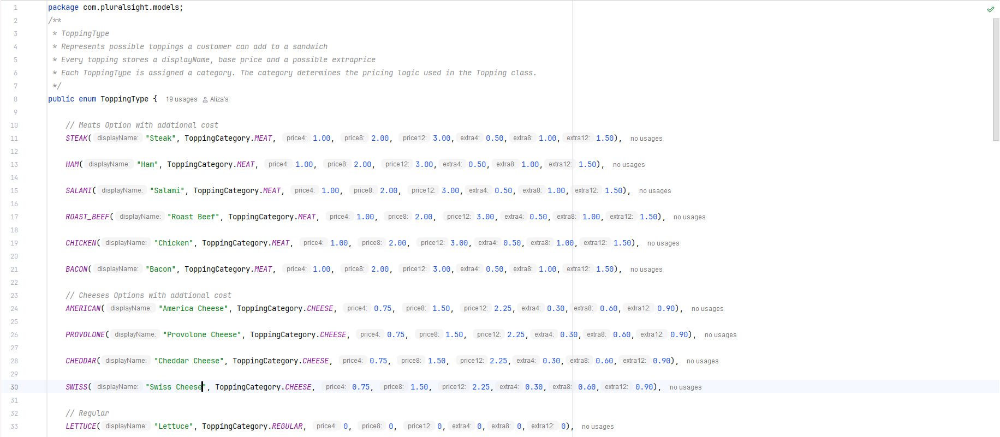

# 🥪 Aliza's Deli  App

### A simple, menu-driven Java application that lets users build a custom deli order — sandwiches, toppings, drinks, chips, sides — and saves an itemized receipt as a `.txt` file.

Key Features :
---
## Food Item
 @  Custom Sandwiches
- Choose sandwich size (4", 8", 12")
- Select bread type
- Toasted or not toasted
- Add toppings grouped into:

 1.  **Regular Topping**

 2.  **Premium Topping** :  ***Cheese*** &  ***Meat***

- Optional extra portion for premium toppings
- Add unlimited sauces and sides 

@ Drinks (size + flavor)

@ Chips (type)

@ Sides 

---
##  Pricing 
- Base price from sandwich size
- Meat & cheese toppings priced by sandwich size
- Extra portion adds extra cost
- Drink sizes priced individually

##  Receipt Generation
- Detailed breakdown of each menu item
- Sandwich itemized details (toppings, sauces, extra portions)
- Order total
- Saved to unique files for each order:  
  `src/main/resources/receipts/<timestamp>.txt`
--- 
## Intresting Code 

